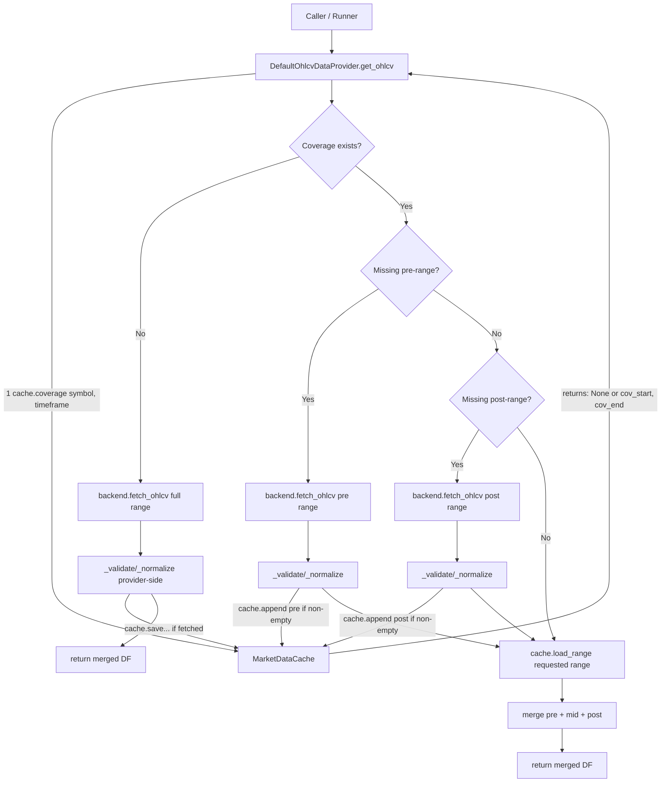

## Backend

Backend to źródło danych. Jedna odpowiedzialność:
  - „Daj mi surowe OHLCV dla symbolu, timeframe i zakresu czasu.”

Przykłady:

  - Mt5Backend
  - DukascopyBackend

Backend:
 - nie wie nic o cache
 - nie wie nic o backteście
 - nie decyduje czy fetchować — tylko jak
 - Nie potrzebuje dziedziczenia.

##Provider
Provider to orchestrator:
    „Sprawdź cache → oblicz braki → dociągnij dane → sklej wynik”

DefaultOhlcvDataProvider:
 - posiada backend (self.backend)
 - posiada cache (self.cache)
 - używa ich przez kontrakt (Protocol)
To jest kompozycja, nie dziedziczenie.