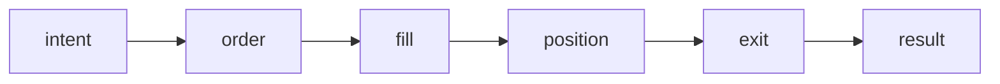

# Execution Model

This document describes the **execution model** used by the framework.

The goal is to clearly separate:
- *decision logic* (strategies)
- *execution mechanics* (engine, adapters, policies)
- *state management* (positions, trades, lifecycle)

The concepts described here are domain-agnostic and applicable
to any system that turns **intents into executed actions**.

---

## Core concepts

### Strategy
A strategy is a **pure decision component**.

Responsibilities:
- consume feature outputs
- produce execution intents (e.g. entry, exit, modify)
- remain agnostic of execution details

Non-responsibilities:
- no direct broker/API calls
- no state mutation outside its own scope
- no implicit access to execution results

---

### Execution Engine
The execution engine is responsible for **orchestrating execution**.

Responsibilities:
- receive intents from the strategy
- apply execution policies
- manage interaction with adapters
- coordinate lifecycle transitions

The engine does not:
- decide *what* to trade
- modify strategy logic
- infer intent semantics implicitly

---

### Adapter
Adapters are **boundary components** between the engine
and the external world.

Examples:
- simulated execution (backtest)
- dry-run execution
- live broker/API execution

Adapters define:
- how orders are placed
- how fills are simulated or received
- how execution feedback is returned

This separation allows the same execution engine
to be reused across multiple environments.

---

### Position and Trade State
State is managed explicitly through dedicated components.

Typical responsibilities:
- track open positions
- register fills and partial fills
- compute realized/unrealized results
- enforce consistency constraints

State transitions are explicit and traceable.

---

## Execution lifecycle (conceptual)

