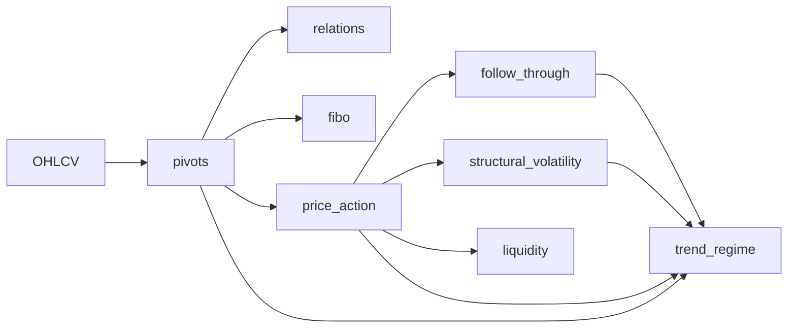

# Feature Modules — Dependency DAG (example: MarketStructure)

Feature computation in this framework is organized as explicit **dependency graphs (DAGs)**  
instead of relying on implicit execution order or chained dataframe mutations.

This document explains the general mechanism and shows one concrete example:
the **MarketStructure** module.

---

## Why a DAG?

In many data pipelines (not only finance), feature computation often becomes:
- order-dependent (columns must exist before other columns)
- hard to test (hidden coupling through shared mutable state)
- inefficient (the same intermediate values recomputed multiple times)

A DAG-based model makes dependencies explicit and enables:
- deterministic execution order derived from the graph
- safe reuse of intermediate results (cache)
- better testability (each node becomes a unit with clear inputs/outputs)

---

## Concepts

- **Feature module**: a cohesive set of feature computations (e.g. MarketStructure).
- **Node**: a computation unit inside a module (e.g. pivots, liquidity).
- **Edge**: dependency between nodes (A must run before B).
- **Computation context**: a scoped store for intermediate results during a run.
- **Outputs**: explicitly selected results assembled into the final dataframe.

This is a generic engineering pattern and can be applied to any domain
where features depend on other features.

---

## Example module: MarketStructure (dependency graph)

The following DAG is for **one module** (MarketStructure).  
Other modules can define their own DAGs and can be composed at higher level.

## How to read the graph
 - Nodes execute only when all dependencies are available.
 - Execution order is derived automatically (topological sort).
 - Intermediate results are stored in the computation context.
Example:
 - trend_regime can run only after pivots, price_action,
follow_through and structural_volatility are available.

## Execution model (module-level)
1. Input data (e.g. OHLCV) is placed into the computation context
2. The module resolves its dependency graph
3. Nodes execute in a deterministic topological order
4. Each node writes outputs into the context (not into the input dataframe)
5. Final dataframe columns are assembled explicitly from selected outputs
This reduces order-dependence and prevents accidental cross-feature coupling.

## Caching and reuse
 - Each node output is cached in the computation context
 - If multiple downstream nodes depend on the same result,
it is computed exactly once per run
 - Cache lifetime is scoped to a single execution run (explicit, predictable)
This enables stable performance characteristics and avoids repeated work.

## Determinism and testability
 - DAG-based feature modules aim to enforce:
 - explicit dependencies (no “magic” column assumptions)
 - deterministic outputs for identical inputs and policies
 - unit-testable nodes with clear inputs/outputs
 - reduced reliance on shared mutable state

## Scaling to multiple modules
This framework is designed to support multiple feature modules.
Each module can:
 - define its own internal DAG
 - expose a clean set of outputs
 - optionally depend on outputs from other modules (explicitly)

MarketStructure is one example module — additional modules can be added
without changing the DAG principles described here.