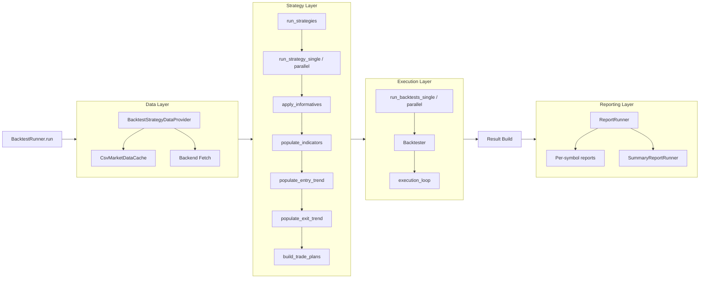
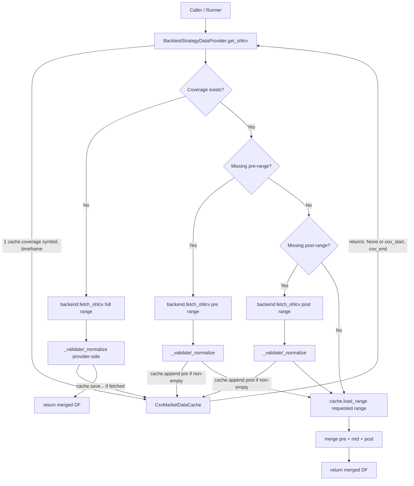

# Pipelines (backtest and live)

This document contains the detailed runner flows.  
README intentionally keeps pipelines simplified.

---

## BacktestRunner — detailed flow

---

## LiveTradingRunner — detailed flow

```mermaid
flowchart LR

    %% =================================================
    %% ENTRY POINT
    %% =================================================
    A[LiveTradingRunner.run]

    %% =================================================
    %% INIT SECTION
    %% =================================================
    subgraph INIT[Initialization]

        B[MT5 initialize]
        C[Symbol select]
        D[Load Strategy Class]
        E[Build Live Logger]

    end

    A --> INIT
    INIT --> B --> C
    INIT --> D
    INIT --> E

    %% =================================================
    %% DATA LAYER
    %% =================================================
    subgraph DATA[Data Layer]

        F[Strategy declares required timeframes]
        G[MT5Client]
        H[LiveStrategyDataProvider]
        I[MT5MarketStateProvider]

    end

    D --> F
    G --> H
    F --> H
    A --> H
    A --> I

    %% =================================================
    %% STRATEGY LAYER
    %% =================================================
    subgraph STRATEGY[Strategy Layer]

        J[LiveStrategyRunner]

        subgraph DOMAIN[Strategy Domain *shared with backtest*]

            K[apply_informatives]
            L[populate_indicators]
            M[populate_entry_trend]
            N[populate_exit_trend]
            O[build_trade_plans]

            K --> L --> M --> N --> O
        end

    end

    H --> J
    D --> J
    J --> K

    %% =================================================
    %% EXECUTION LAYER
    %% =================================================
    subgraph EXECUTION[Execution Layer]

        P[LiveEngine]
        Q[PositionManager]
        R[TradeRepo / TradeStateService]
        S[MT5Adapter]
        T[MetaTrader5 API]

    end

    %% =================================================
    %% RUNTIME FLOW
    %% =================================================

    %% Market state into engine
    I --> P

    %% Trade plans into engine
    O --> P

    %% Engine orchestration
    P --> Q
    Q --> R
    Q --> S
    S --> T

    %% =================================================
    %% FEEDBACK LOOPS
    %% =================================================

    T -->|broker-driven exits| Q
    P -->|tick loop| P
```

## BacktestDataProvider — detailed flow
