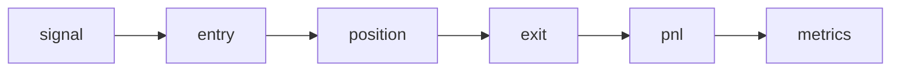

# Signal to Result Lifecycle

This document describes the **end-to-end lifecycle**
from strategy intent to measured results.

The lifecycle is explicit, observable and auditable.

---

## Conceptual lifecycle

## Signal

 - A signal represents intent, not execution.

 - Signals are generated by strategy logic based on features.

 - Signals do not mutate state.

## Entry

 - Entry defines how a signal is translated into an order.

 - Entry rules are subject to execution policies.

 - Rejected or skipped entries are recorded explicitly.

##Position

 - A position represents an active exposure.

 - Positions track:

    - size

    - entry price(s)

    - execution costs

    - duration

 - Partial fills and adjustments are modeled explicitly.

## Exit

 - Exits are triggered by:

   - strategy intent

   - risk rules

   - execution constraints

## PnL attribution

 - Profit and loss is decomposed into:

 - price movement

 - spread cost

 - slippage

 - financing / holding cost

This allows inspection of where results actually come from.

## Metrics

Metrics are computed after execution completes.

Examples:

 - trade-level expectancy

 - drawdown structure

 - exposure and concurrency

 - recovery characteristics

Metrics never influence strategy behavior retroactively.