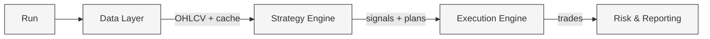
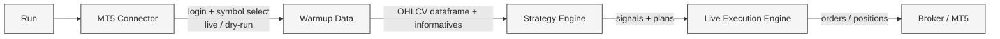
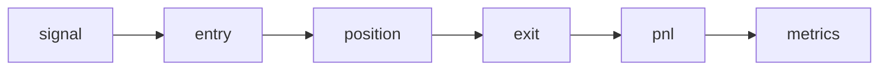

# Deterministic Systematic Trading Framework

High-performance, deterministic Python framework for systematic trading.  
Unified pipeline: **data → features → strategy → execution → reporting**.  
Designed for **research, backtesting and live trading using the same code path**.

- Deterministic dataflow (no hidden state, no lookahead bias)
- Dependency-aware feature engines (DAG with cached context)
- Same pipeline for backtest, dry-run and live execution
- Stress-tested at high signal density (hundreds of thousands of signals)
- Focus on engineering correctness and execution realism — not alpha marketing

---

## Backtest run pipeline

---

## Live run pipeline

---

## Architecture

Architecture is designed for **deterministic computation, modularity and testability**.

- Feature computation organized as a dependency-aware DAG
- Explicit separation: computation context vs final dataframe outputs
- Vectorized pandas with optional numba hot paths
- No global mutable state, reproducible runs
- Same execution engine reused across backtest and live trading
- Explicit execution policies and structured cost model  
  (spread / slippage / financing)

---

## Research

Research workflow enforces execution realism by construction.

- No lookahead bias by design
- Multi-timeframe market structure features
- Explicit signal → trade lifecycle
- Stress-tested with intentionally high signal density
- Net PnL includes spread, slippage and financing
- Same logic used in research and live execution

---

## Reporting & dashboards

Interactive reporting includes:

- Equity curve & drawdown structure
- Execution cost attribution
- Exposure & capital analytics
- Conditional expectancy breakdown

👉 **Sample dashboard:**  
https://folg-code.github.io/pandas-quant-trading-framework/

---

## Roadmap

Short-term focus:

- Comprehensive test suite  
  (tests were intentionally deferred during heavy architectural refactors;  
  architecture is now stable and formal coverage becomes top priority)
- Finalize TechnicalAnalysis refactor (architecture cleanup)
- Feature research and development
- Portfolio-level risk aggregation
- Multi-strategy comparison dashboard
- Scenario stress-testing framework
- Execution simulator extensions

---

## Disclaimer

This project is intended for **research and engineering purposes**.  
It does not constitute financial advice and does not attempt to market trading alpha.
