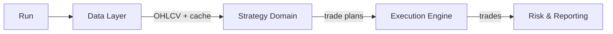
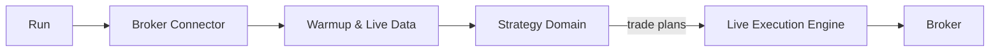
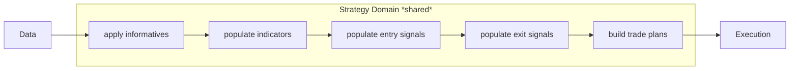
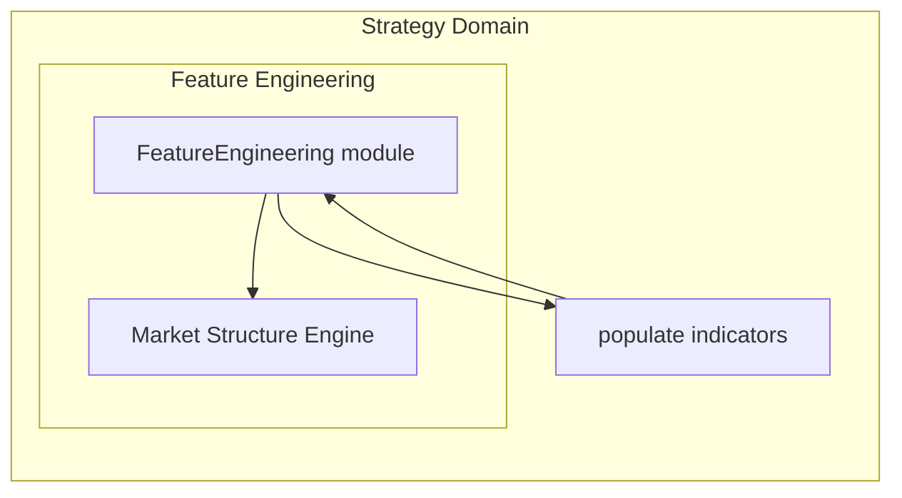
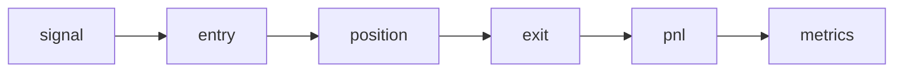

# Deterministic Systematic Trading Framework

High-performance, deterministic Python framework for systematic trading.  
Unified pipeline: **data → features → strategy → execution → reporting**.  

Designed for **research, backtesting and live trading using the same code path**.

- Deterministic dataflow (no hidden state, no lookahead bias)
- Explicit separation of data, features, strategy and execution
- Same strategy domain reused in backtest, dry-run and live trading
- Dependency-aware feature computation (DAG with cached context)
- Stress-tested at high signal density (hundreds of thousands of signals)
- Focus on engineering correctness and execution realism — not alpha marketing

---

## Backtest run pipeline (high level)

---

## Live run pipeline (high level)

### Key point:
Both backtest and live execution use the same Strategy Domain.
Differences are limited to orchestration, data sources and side effects.

---

## Shared Strategy Domain

The strategy layer is implemented as a pure, deterministic domain shared between backtest and live execution.

Both modes execute the same sequence:

 - multi-timeframe data alignment
 - feature computation
 - entry and exit signal generation
 - trade plan construction

Differences between backtest and live are strictly limited to:

 - historical vs broker data sources
 - full-range vs candle-based orchestration
 - simulated vs real execution side effects

This ensures that live trading decisions are structurally identical to those evaluated during research.

---

## Feature Engineering

Strategy logic operates exclusively on engineered features, computed directly from  raw price series.

Feature computation is handled by a dedicated FeatureEngineering module, whose responsibility is to transform
price action into clean, explicit, strategy-ready features.

Strategies consume engineered features, not price series.

Key characteristics:

 - Deterministic and reproducible feature computation
 - Dependency-aware execution (explicit feature DAG)
 - No implicit state or hidden coupling
 - Identical feature pipeline used in backtest and live trading

The FeatureEngineering module is extensible by design and currently includes,
among others, a Market Structure Engine for price behavior analysis.

Market Structure analysis is treated as one implementation detail of feature extraction,
not as a strategy or execution concern.

---

## Architecture principles

Architecture is designed for deterministic computation, modularity and testability.

 - Explicit separation of concerns:
   - data access
   - feature computation
   - strategy logic
   - execution side effects
 - Dependency-aware feature engines (DAG)
 - Vectorized pandas with optional numba hot paths
 - No global mutable state, reproducible runs
 - Same execution semantics reused across backtest and live trading
 - Explicit execution policies and structured cost model (spread / slippage / financing)

---

## Performance characteristics

The framework is designed to handle **large historical datasets and high signal density**
without sacrificing determinism or architectural clarity.

A representative backtest run (2 symbols, multi-timeframe, full feature pipeline):

- ~540k OHLCV bars per symbol (M1 base timeframe)
- Multi-timeframe feature computation (M1 + M30)
- ~16k generated signals
- ~4k executed trades
- Full execution cost modeling and reporting

Observed wall-clock performance on a typical workstation:

- Data loading & caching: ~22s
- Strategy execution (features + signals + plans): ~25s (12.5s per symbol)
- Backtest execution (parallel): ~1.9s
- Reporting & persistence: <1s

**Total end-to-end runtime:** ~53s

The system has been stress-tested with intentionally higher signal density
(hundreds of thousands of signals) to validate execution scalability.

---

### Profiling insights

Runtime profiling confirms that execution time is dominated by expected domains:

- Data access and preprocessing (historical OHLCV loading and caching)
- Feature engineering, including dependency-aware market structure analysis
- Vectorized pandas operations inside feature computation

Orchestration, execution control flow and trade simulation introduce negligible overhead.
This validates the architectural separation between:
- deterministic computation
- orchestration
- execution side effects

FeatureEngineering hot paths are explicitly identified and measured,
making further optimization (e.g. numba acceleration or alternative representations)
a targeted, incremental process rather than a speculative refactor.

---
## Research Workflow

Research workflow enforces execution realism by construction.

- No lookahead bias by design
- Multi-timeframe market structure features
- Explicit signal → trade lifecycle
- Stress-tested with intentionally high signal density
- Net PnL includes spread, slippage and financing
- Same logic used in research and live execution

---

## Reporting & dashboards

Interactive reporting includes:

- Equity curve & drawdown structure
- Execution cost attribution
- Exposure & capital analytics
- Conditional expectancy breakdown

👉 **Sample dashboard:**  
https://folg-code.github.io/pandas-quant-trading-framework/

---

## Documentation

Additional documentation describing architectural details and design decisions:

- **Architecture overview**  
  [`docs/architecture/pipelines.md`](docs/architecture/pipelines.md)  
  Detailed breakdown of backtest and live pipelines, shared strategy domain
  and execution responsibilities.

- **Feature engineering**  
  [`docs/architecture/feature_engine-dag.md`](docs/architecture/feature_engine-dag.md)  
  Design philosophy, dependency-aware feature DAG and extensibility model.

- **Performance & profiling**  
  [`docs/dev/performance.md`](docs/dev/performance.md)  
  End-to-end runtime measurements, profiling results and optimization strategy.

- **Reporting overview*  
  [`docs/reporting/overviw.md`](docs/reporting/overviw.md)  
  Overview for reports methodology and renders .

---

## Roadmap

Top priority:

- Automated lookahead-bias detection 
  (systematic verification that strategy logic does not access future data,
  across multi-timeframe features and execution paths)
While the architecture is designed to prevent lookahead by construction,
the goal is to make temporal correctness explicitly testable and provable.

Recently completed:

- Deterministic test suite covering:
  - strategy domain (signals and trade plans)
  - backtest and live execution
  - data providers 
- Architectural stabilization after major refactors

Short-term focus:

- Finalize FeatureEngineering refactor
- Feature research and development
- Portfolio-level risk aggregation
- Multi-strategy comparison dashboard
- Scenario-based stress-testing framework
- Execution simulator extensions

---